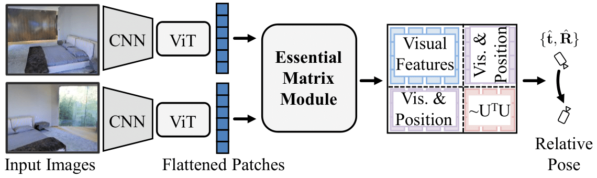

# The 8-Point Algorithm as an Inductive Bias for Relative Pose Prediction by ViTs (3DV 2022)

**Chris Rockwell**, **Justin Johnson** and **David F. Fouhey**

[Project Website](https://crockwell.github.io/rel_pose/) | [Paper](https://crockwell.github.io/rel_pose/data/paper.pdf) |
[Supplemental](https://crockwell.github.io/rel_pose/data/supp.pdf)



## Overview
We propose three small modifications to a ViT via the Essential Matrix Module, enabling computations similar to the
Eight-Point algorithm. The resulting mix of visual and positional features is a good inductive bias for pose estimation.

## Installation and Demo

Anaconda install:
```
conda install environment.yml
```
Download & extract pretrained models replicating paper results:
```
wget https://fouheylab.eecs.umich.edu/~cnris/rel_pose/modelcheckpoints/pretrained_models.zip --no-check-certificate
unzip pretrained_models.zip
```
Demo script to predict pose on arbitrary image pair:
```
python demo.py --img1 demo/matterport_1.png --img2 demo/matterport_2.png --ckpt pretrained_models/matterport.pth
python demo.py --img1 demo/interiornet_t_1.png --img2 demo/interiornet_t_2.png --ckpt pretrained_models/interiornet_t.pth
python demo.py --img1 demo/streetlearn_t_1.png --img2 demo/streetlearn_t_2.png --ckpt pretrained_models/streetlearn_t.pth
```

## Evaluation

Download and setup data following the steps of [Jin et al.](https://github.com/jinlinyi/SparsePlanes/blob/main/docs/data.md) (Matterport) and [Cai et al.](https://github.com/RuojinCai/ExtremeRotation_code) (InteriorNet and StreetLearn). 
- StreetLearn and InteriorNet require rendering. See [here](https://github.com/RuojinCai/ExtremeRotation_code#dataset) for more details. You'll need to clone their repo for rendering as well as to get dataset metadata.
- Matterport does not require rendering:
```
wget https://fouheylab.eecs.umich.edu/~jinlinyi/2021/sparsePlanesICCV21/split/mp3d_planercnn_json.zip
wget https://fouheylab.eecs.umich.edu/~jinlinyi/2021/sparsePlanesICCV21/data/rgb.zip
unzip mp3d_planercnn_json.zip; unzip rgb.zip
```
- You'll need to update `scripts/export_paths.sh` to root directories once datasets are setup.

Evaluation scripts are as follows:
```
sh scripts/eval_matterport.sh
sh scripts/eval_interiornet.sh
sh scripts/eval_interiornet_t.sh
sh scripts/eval_streetlearn.sh
sh scripts/eval_streetlearn_t.sh
```

## Training

Data setup is the same as in evaluation. Training scripts are as follows:
```
sh scripts/train_matterport.sh
sh scripts/train_interiornet.sh
sh scripts/train_interiornet_t.sh
sh scripts/train_streetlearn.sh
sh scripts/train_streetlearn_t.sh
```

## Small Data

To train with small data, simply add the argument `--use_mini_dataset` to train script; eval is unchanged.

Pretrained models trained on the small InteriorNet and StreetLearn datasets are here.
```
wget https://fouheylab.eecs.umich.edu/~cnris/rel_pose/modelcheckpoints/pretrained_models_mini_dataset.zip --no-check-certificate
```

## Citation
If you use this code for your research, please consider citing:
```
@inProceedings{Rockwell2021,
  author = {Chris Rockwell and Justin Johnson and David F. Fouhey},
  title = {The 8-Point Algorithm as an Inductive Bias for Relative Pose Prediction by ViTs},
  booktitle = {3DV},
  year = 2022
}
```

## Special Thanks
Thanks to <a href="https://jinlinyi.github.io/">Linyi Jin</a>, <a href="https://www.cs.cornell.edu/~ruojin/">Ruojin Cai</a> and <a href="https://zachteed.github.io/">Zach Teed</a> for help replicating and building upon their works. Thanks to <a href="https://mbanani.github.io/">Mohamed El Banani</a>, <a href="http://kdexd.xyz/">Karan Desai</a> and <a href="https://nileshkulkarni.github.io/">Nilesh Kulkarni</a> for their many helpful suggestions. Thanks to Laura Fink and UM DCO for their tireless support with computing!
